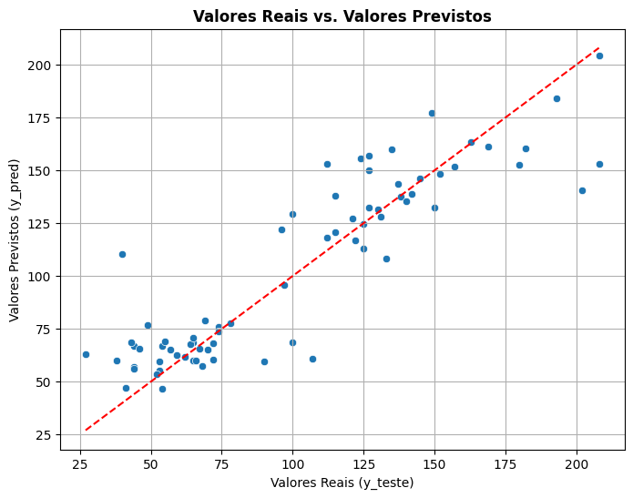
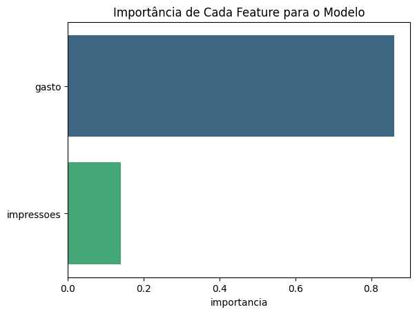
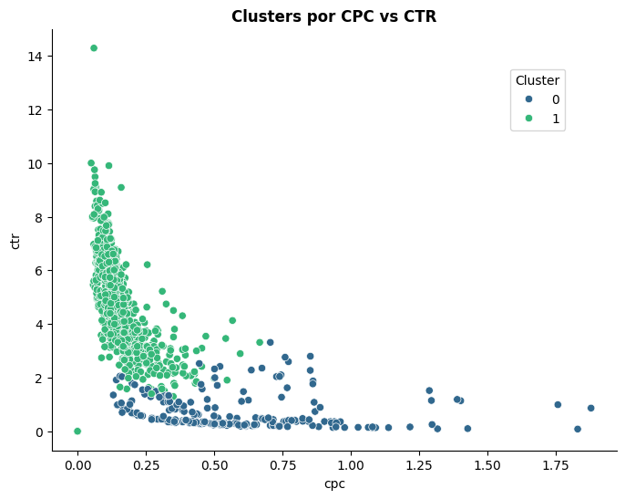

# Análise e Previsão de Performance de Campanhas - Meta Ads

## Visão Geral do Projeto

Este projeto demonstra a aplicação de Machine Learning para analisar e prever o desempenho de campanhas no Meta Ads. O foco principal é otimizar campanhas de **conversão (reservas via Tagme)** através da identificação de padrões e a previsão de resultados, bem como a categorização de conjuntos de anúncios (adsets) com base em sua eficiência.

O projeto foi desenvolvido para extrair dados diretamente da Meta Ads API, processá-los e, em seguida, aplicar técnicas de modelagem preditiva e clusterização para gerar insights acionáveis.

## Estrutura do Projeto

A estrutura do projeto é organizada da seguinte forma:
```
ads-machinelearning/
├── notebooks/
│   └── experimento.ipynb          # Notebook Jupyter com a análise e modelos
├── pipeline/
│   └── meta_ads_pipeline.py       # Script Python para extração e pré-processamento dos dados
├── plots/                         # Pasta com imagens para o Readme
│   ├── clusters_cpc_ctr.png
│   ├── importancia_features.png
│   └── modelo-regressao.png      
├── .gitignore                     # Arquivo para ignorar arquivos e pastas
├── LICENSE                        # Arquivo de licença
└── requirements.txt               # Lista de dependências do Python
```

## Metodologia e Modelagem

### Extração de Dados

Os dados foram coletados diretamente da Meta Ads API, focando nas seguintes métricas no nível de `adset` (conjunto de anúncios) para os últimos 90 dias:

* `campaign_name`: Nome da campanha.
* `spend`: Gasto total.
* `inline_link_clicks`: Cliques no link.
* `reach`: Alcance.
* `impressions`: Impressões.
* `ctr`: Taxa de cliques (Click-Through Rate).
* `cpc`: Custo por clique (Cost Per Click).

O script `pipeline/meta_ads_pipeline.py` é responsável por essa extração e pré-processamento.

### Modelagem Preditiva

Para prever o número de cliques (`inline_link_clicks`), foram treinados modelos de **Regressão Linear** e **Random Forest Regressor**, utilizando `spend` (gasto) e `impressions` (impressões) como features. A campanha de "Conversão - Reservas Tagme" foi o foco dessa análise.

**Resultados:**

* **Regressão Linear:** $R^2$ de 0.80.
* **Random Forest:** $R^2$ de 0.83.

Um $R^2$ de 0.80, significa que 80% da variação no número de cliques pode ser explicada pelo nosso modelo. Sendo assim, ambos os modelos apresentaram bom desempenho, com o modelo de Regressão Linear sendo considerado suficiente devido à sua simplicidade e interpretabilidade, sem grande perda de acurácia em comparação com o Random Forest.

**Visualização: Valores Reais vs. Valores Previstos (Regressão Linear)**



#### Importância das Features

A análise da importância das features para o modelo Random Forest revelou que o **`gasto` é a feature mais influente** na previsão do número de cliques. Isso comprova que o investimento direto é, de fato, o motor principal para a geração de resultados. Isso ocorre porque, quanto maior o investimento, mais o algoritmo da Meta consegue atuar dentro desse grupo seleto e qualificado de pessoas, gerando cliques de maior valor que se traduzem em conversões efetivas.

| Feature    | Importância |
| :--------- | :---------- |
| `gasto`    | 0.86        |
| `impressoes` | 0.14        |

**Visualização: Importância de Cada Feature para o Modelo**



### Clusterização K-Means

A técnica de clusterização K-Means foi aplicada aos dados (após escalonamento para padronizar as métricas como `impressões` e `cpc`) para identificar grupos de conjuntos de anúncios com comportamentos semelhantes. O Método do Cotovelo (`Elbow Method`) indicou **K=2** como o número ideal de clusters.

**Análise dos Clusters (médias por grupo):**

| Cluster | Gasto (R$) | Impressões | Cliques no Link | CPC (R$) | CTR (%) |
| :------ | :--------- | :--------- | :-------------- | :------- | :------ |
| **0** | 24.53      | 11234.16   | 14.88           | 0.58     | 0.74    |
| **1** | 20.36      | 3305.65    | 110.22          | 0.16     | 4.66    |

**Visualização: Clusters por CPC vs CTR**



**Interpretação dos Clusters:**

* **Cluster 1: O Grupo de Alta Eficiência**
    * Caracterizado por **alta taxa de clique - CTR (4.66%)** e **baixo custo por clique - CPC (R$ 0.16)**. Representa os conjuntos de anúncios com melhor desempenho, indicando estratégias eficazes.
    * **Insights:** É fundamental analisar em profundidade esses anúncios para identificar fatores de sucesso (CTAs, criativos, promoções, textos) e replicá-los.

* **Cluster 0: O Grupo de Baixa Performance**
    * Apresenta **baixa CTR (0.74%)** e **CPC elevado (R$ 0.58)**. Este grupo indica anúncios com performance insatisfatória.
    * **Insights:** Requer atenção imediata para monitorar criativos, aplicar otimizações ou pausar anúncios ineficientes e redistribuir o orçamento para iniciativas mais promissoras.

## Conclusão

Este projeto demonstra como a análise de dados e o uso de modelos de Machine Learning (regressão e clusterização) podem fornecer insights para a otimização de campanhas de marketing digital. A identificação dos principais drivers de desempenho e a segmentação de campanhas por eficiência permitem decisões mais estratégicas e a melhoria contínua do ROI (Retorno sobre Investimento) em Meta Ads.
